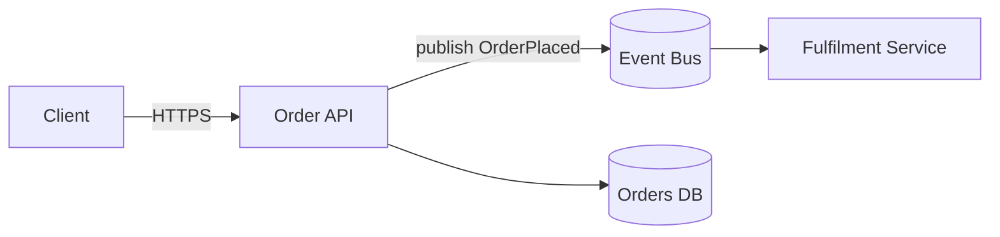

# Architecture Documentation

## Purpose

This document defines what architecture documentation to write, how to keep it accurate,
and where it should live. It covers system diagrams, READMEs, API contracts, and the
relationship between prose documentation and [ADRs](26-architecture-decision-records.md).
It is written so an agent can produce documentation that a future engineer — or another
agent — can trust and act on.

Good documentation captures what code cannot: the *why*, the boundaries, the trade-offs,
and the shape of the system as a whole. It is not a transcript of the code; it is the map.

## Why It Matters

Undocumented architecture lives only in the heads of the people who built it, and those
people leave. New engineers (and agents) then reverse-engineer intent from code, guess at
boundaries, and reintroduce mistakes that were already solved and forgotten. The cost is
paid continuously in slow onboarding, duplicated systems, and decisions relitigated
because no one remembers why the last one was made. The failure mode of *wrong*
documentation is worse than missing documentation: it actively misleads. So the goal is
not volume — it is a small set of documents that stay true.

## Core Principles

- **Document decisions and boundaries, not line-by-line behavior.** Code already states
  *what* it does; documentation must state *why* and *where the seams are*.
- **Docs live with the code they describe.** Keep them in the repo, versioned in the same
  commit as the change, and reviewed in the same PR. A wiki drifts; a `docs/` folder in
  the repo does not.
- **Stale docs are a bug.** A document that no longer matches reality is worse than none.
  If a change invalidates a doc, the change is not done until the doc is fixed.
- **Write for the reader who arrives cold.** Assume no shared context. State the problem
  the system solves before describing how.
- **Prefer the smallest artifact that answers the question.** A crisp diagram beats a page
  of prose; a link beats a copy.

## Best Practices

- Give every service a README that answers, in order: what it does, its key dependencies,
  how to run it locally, and where to look when it breaks. This is the highest-leverage
  page in the repo.
- Draw system context and container diagrams using the **C4 model** (context → container →
  component); pick the zoom level that answers the reader's question and stop there.
- Store diagrams as **text** (Mermaid, PlantUML) in the repo, not as binary exports, so
  they diff, review, and update like code.
- Treat the API contract as documentation: keep an OpenAPI/AsyncAPI spec in the repo and
  generate reference docs from it, so the docs cannot drift from the interface.
- Record significant decisions as [ADRs](26-architecture-decision-records.md); link from
  the README to the ADR index. Prose docs describe the current state; ADRs preserve the
  history of *why*.
- Automate what you can: generate API references, dependency graphs, and schema docs in
  CI so they regenerate on every change and never go stale.
- Delete documentation that has outlived its subject. Fewer, true pages beat many rotting
  ones.

## Examples

**Good Example** — a versioned, text-based diagram that lives with the code

````markdown
<!-- docs/architecture.md — reviewed in the same PR as code changes -->
## Order flow (container view)



Boundary note: the API owns the Orders DB. Fulfilment reacts to events and never
reads Orders DB directly — this keeps the services independently deployable.
See ADR-0012 for why we chose events over a synchronous call.
````

**Bad Example** — prose that restates code and rots silently

```markdown
<!-- wiki page, last edited 14 months ago, never reviewed with code -->
The OrderService has a method createOrder() that takes an order and saves it.
It calls save() which inserts a row. Then it calls the fulfilment service on
port 8081 by making an HTTP POST to /fulfil.   <!-- port and call style are now
wrong: it's been event-driven for a year. The doc actively misleads. -->
```

## Common Mistakes

- Documenting *what the code does* line by line — it duplicates the code and rots the
  moment the code changes.
- Keeping docs in an external wiki that is never reviewed alongside the code it describes.
- Exporting diagrams as PNGs no one can edit or diff, so they are never updated.
- Writing one giant diagram at every zoom level instead of the C4 level the reader needs.
- Letting the API reference drift from the actual contract by writing it by hand.
- No README, so the only way to run or understand a service is to ask the author.

## Production Tips

- Add a CI check that fails the build when a touched module's public interface changes but
  its docs/spec do not — this makes stale docs visible at review time.
- Keep an ADR index (`docs/adr/README.md`) as the entry point to architectural history.
- Put a "last verified" date on long-lived overview docs so readers can gauge trust.

## AI Review Checklist

- Does each service have a README covering purpose, dependencies, local run, and debugging?
- Do diagrams live as text in the repo and get reviewed in the same PR as code?
- Does the documentation explain *why* and *where the boundaries are*, not restate code?
- Is the API reference generated from a spec rather than hand-maintained?
- Are significant decisions captured as ADRs and linked from the README?
- Has every doc invalidated by this change been updated in the same commit?

## Related

- `knowledge/architecture/26-architecture-decision-records.md`
- `knowledge/architecture/00-overview.md`
- `knowledge/architecture/11-api-first.md`
- `knowledge/architecture/27-architecture-review.md`
- `knowledge/architecture/28-best-practices.md`
